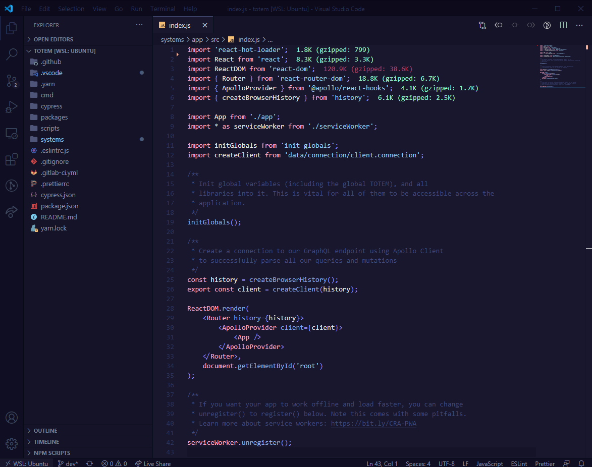

# [Minuit](https://github.com/mubartok/minuit-vscode-theme) 

<!--  -->

Minuit is a Visual Studio Code theme inspired by [Dan Abramov's Overreacted](https://overreacted.io/) color scheme, which was itself based on [Sarah Drasner's Night Owl](https://github.com/sdras/night-owl-vscode-theme/) syntax theme. It comes in two variants: Minuit and Minuit Soft (with lowered contrast).

## Minuit

## Minuit Soft

# Installation steps

-   Choose Extensions from VSCode menu (macOS: `Cmd + Shift + X`, Windows: `Ctrl + Shift + X`)
-   Search for minuit
-   Click Install
-   Click Reload or restart your editor
-   Go to Code > Preferences > Color Theme > Minuit (or with macOS: `Cmd + Shift + P`, Windows: `Ctrl + Shift + P`, then Preferences: Color Theme and select Minuit)
-   Minuit is now your default theme 🙌

### Notes

This theme is still a work in progress, so please don't hesitate to [fill an issue](https://github.com/mubartok/minuit-vscode-theme/issues) if something is missing or doesn't work as intended.
