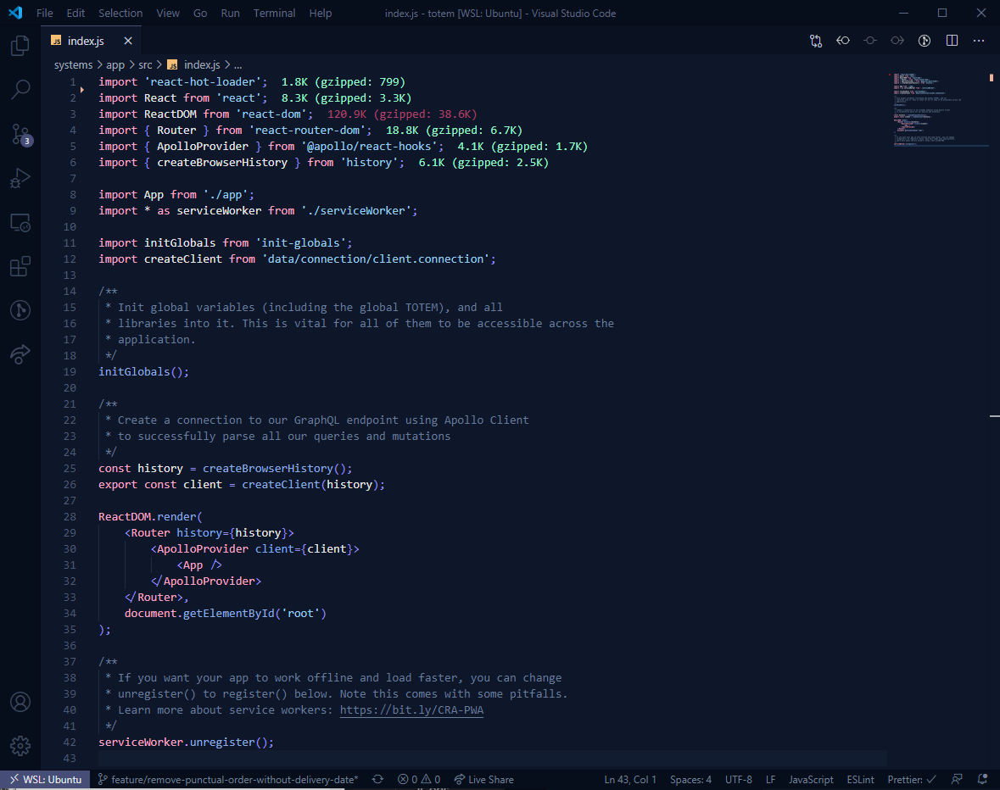
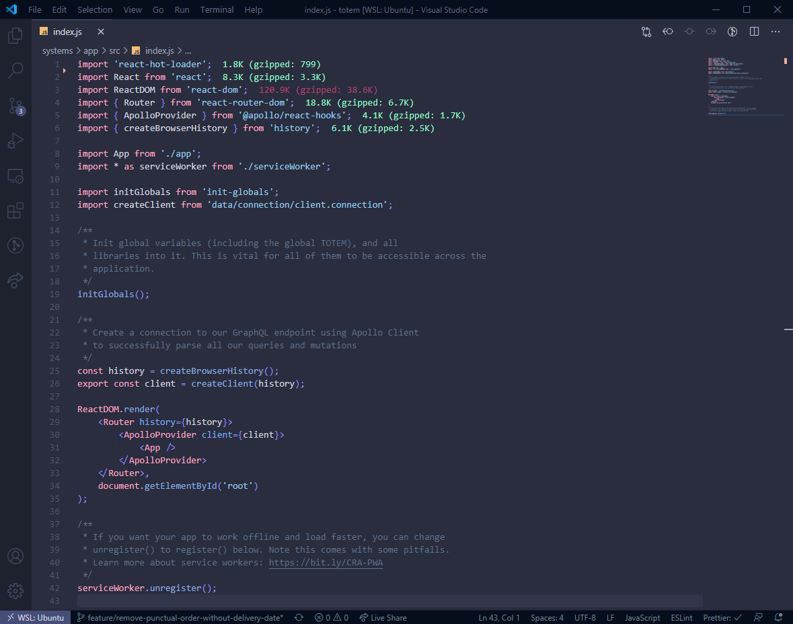

# Minuit 

Minuit is a Visual Studio Code theme inspired by [Dan Abramov's Overreacted](https://overreacted.io/) color scheme, with less, even softer colors. You will also get Minuit Soft with lowered contrast.

## Minuit

## Minuit Soft

# Installation steps
- Choose Extensions from VSCode menu (macOS: `Cmd + Shift + X`, Windows: `Ctrl + Shift + X`)
- Search for minuit
- Click Install
- Click Reload or restart your editor
- Go to Code > Preferences > Color Theme > Minuit (or with macOS: `Cmd + Shift + P`, Windows: `Ctrl + Shift + P`, then Preferences: Color Theme and select Minuit)
- Minuit is now your default theme 🙌

### Notes

This is my first theme and is still a work in progress, so please don't hesitate to [fill an issue](https://github.com/mubartok/minuit-vscode-theme/issues) if something is missing or doesn't work properly for you.
